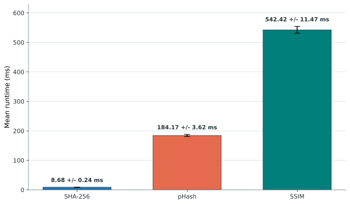

# Evaluation 1: Pipeline Runtime

## Objective

Evaluation 1 establishes the runtime profile of the cost-ordered pipeline. The
baseline configuration uses a pHash Hamming-distance threshold of 5 and an SSIM
threshold of 0.85. The benchmark contains 100 files totalling 10.37 MB, including
10 exact duplicate groups.

## Results

*Figure 4.1. Mean stage runtime with standard-deviation error bars.*

[PNG version](../thesis-assets/figure-4-1-eval1-runtime-by-stage.png) | [SVG version](../thesis-assets/figure-4-1-eval1-runtime-by-stage.svg)

| Stage | Mean runtime (ms) | Standard deviation (ms) |
| --- | ---: | ---: |
| SHA-256 exact matching | 8.68 | 0.24 |
| pHash candidate generation | 184.17 | 3.62 |
| SSIM structural verification | 542.42 | 11.47 |
| **Complete pipeline** | **735.27** | **12.10** |

Stage 1 identified 10 redundant files. Stage 2 produced 53 candidate pairs, of
which Stage 3 verified 49. Peak pipeline memory was 11.96 MB.

## Interpretation

SSIM accounts for most of the measured runtime, while SHA-256 contributes very
little. The result supports the cost-ordered architecture: exact matching should
remain first, and pHash should reject dissimilar pairs before SSIM. Performance
optimisation should therefore focus on reducing candidate pairs or the cost of
structural verification without weakening detection quality.

**Data source:** `results/interim/eval1/metrics/table_eval1_summary.csv`