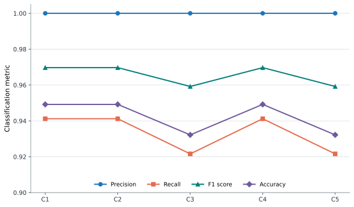

# Evaluation 2: Threshold Selection

## Objective

Evaluation 2 measures how nearby pHash and SSIM threshold choices affect
classification quality. Five configurations were tested against 59 labelled
pairs. C1 is the selected baseline, using a pHash threshold of 5 and an SSIM
threshold of 0.85.

## Results

*Figure 4.2. Precision, recall, F1 score, and accuracy for configurations C1-C5.*

[PNG version](../thesis-assets/figure-4-2-eval2-detection-by-configuration.png) | [SVG version](../thesis-assets/figure-4-2-eval2-detection-by-configuration.svg)

| Configuration | pHash | SSIM | Precision | Recall | F1 score | Accuracy |
| --- | ---: | ---: | ---: | ---: | ---: | ---: |
| C1 (baseline) | 5 | 0.85 | 1.0000 | 0.9412 | 0.9697 | 0.9492 |
| C2 | 4 | 0.85 | 1.0000 | 0.9412 | 0.9697 | 0.9492 |
| C3 | 5 | 0.90 | 1.0000 | 0.9216 | 0.9592 | 0.9322 |
| C4 | 6 | 0.85 | 1.0000 | 0.9412 | 0.9697 | 0.9492 |
| C5 | 6 | 0.90 | 1.0000 | 0.9216 | 0.9592 | 0.9322 |

## Interpretation

All configurations produced perfect precision and therefore no false-positive
detections in this dataset. Changing the pHash threshold from 4 to 6 did not
alter the reported classification metrics when the SSIM threshold remained
fixed. Raising SSIM from 0.85 to 0.90 introduced one additional false negative,
reducing recall from 0.9412 to 0.9216. C1 retains the less restrictive SSIM
threshold and was selected as the balanced baseline for later evaluations.

**Data source:** `results/interim/eval2/metrics/table_eval2_detection_summary.csv`