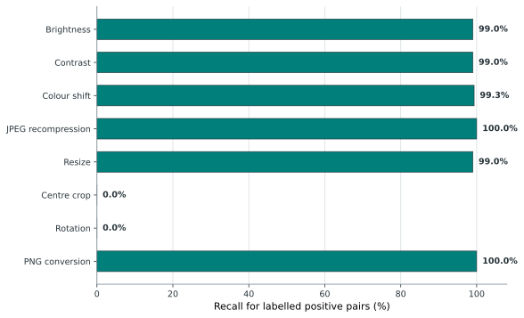

# Evaluation 3: Transformation Robustness

## Objective

Evaluation 3 tests whether the selected baseline recognises near-duplicate
images after common photometric, compression, geometric, and format changes.
Each labelled positive pair links an original image to one transformed variant.
Recall is reported separately for each transformation so that aggregate results
do not hide transformation-specific weaknesses.

## Results

*Figure 4.3. Recall for labelled positive pairs, grouped by transformation.*

[PNG version](../thesis-assets/figure-4-3-eval3-recall-by-transformation.png) | [SVG version](../thesis-assets/figure-4-3-eval3-recall-by-transformation.svg)

The evaluation covers brightness and contrast adjustment, colour-channel shift,
JPEG recompression, resizing, centre cropping, small-angle rotation, and PNG
conversion. The chart uses transformation-level recall because the cost-ordered
pipeline can reject a pair before SSIM; a missed pair therefore represents the
behaviour of the complete cascade rather than a single metric in isolation.

| Transformation | Detected | Labelled positives | Recall |
| --- | ---: | ---: | ---: |
| Brightness | 99 | 100 | 99.0% |
| Contrast | 99 | 100 | 99.0% |
| Colour shift | 149 | 150 | 99.3% |
| JPEG recompression | 150 | 150 | 100.0% |
| Resize | 99 | 100 | 99.0% |
| Centre crop | 0 | 100 | 0.0% |
| Rotation | 0 | 100 | 0.0% |
| PNG conversion | 50 | 50 | 100.0% |

## Interpretation

The detector achieves at least 99% recall for photometric changes, JPEG
recompression, resizing, and format conversion. It does not detect any of the
centre-cropped or rotated positive pairs. Those operations alter spatial
alignment, exposing a clear limitation in a pipeline that does not perform
geometric registration. The aggregate robustness result should therefore not be
reported without this transformation-level distinction.

**Data sources:**

- `data/labels/reference_labels_eval_v2_robustness.csv`
- `results/interim/eval3/predictions/eval3-robustness-c1-stage3.csv`