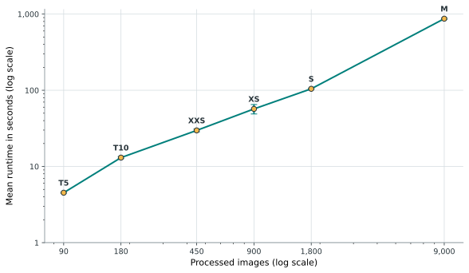
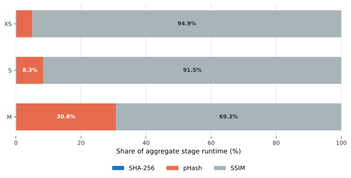

# Evaluation 4: Scalability

## Objective

Evaluation 4 measures runtime, throughput, memory use, and stage composition as
the workload grows. The selected C1 thresholds are held constant so that changes
reflect workload size rather than threshold tuning. Each base image contributes
its original plus transformed variants to the processed workload.

## Runtime growth

*Figure 4.4. Mean runtime by workload size; both axes use logarithmic scales and error bars show standard deviation.*

[PNG version](../thesis-assets/figure-4-4-eval4-runtime-growth.png) | [SVG version](../thesis-assets/figure-4-4-eval4-runtime-growth.svg)

| Workload | Base images | Processed images | Mean runtime (s) | Throughput (images/s) | Peak RAM (MB) |
| --- | ---: | ---: | ---: | ---: | ---: |
| T5 | 5 | 90 | 4.522 | 19.902 | 11.89 |
| T10 | 10 | 180 | 13.063 | 13.779 | 11.91 |
| XXS | 25 | 450 | 29.732 | 15.135 | 11.97 |
| XS | 50 | 900 | 56.929 | 15.809 | 12.20 |
| S | 100 | 1,800 | 104.566 | 17.214 | 12.63 |
| M | 500 | 9,000 | 870.179 | 10.343 | 15.89 |

Runtime rises from 4.52 seconds for 90 processed images to 870.18 seconds for
9,000 images. Peak memory grows by only 4 MB across the same range, indicating
that runtime and pair comparison growth, rather than memory retention, is the
principal scaling constraint.

## Runtime composition

*Figure 4.5. Share of aggregate stage runtime for the larger measured workloads.*

[PNG version](../thesis-assets/figure-4-5-eval4-runtime-composition.png) | [SVG version](../thesis-assets/figure-4-5-eval4-runtime-composition.svg)

| Workload | SHA-256 | pHash | SSIM |
| --- | ---: | ---: | ---: |
| XS | 0.139% | 4.948% | 94.913% |
| S | 0.155% | 8.304% | 91.541% |
| M | 0.109% | 30.580% | 69.311% |

## Interpretation

SSIM remains the largest runtime component, but pHash's share increases from
4.9% at XS to 30.6% at M as the candidate-search workload grows. SHA-256 remains
below 0.2% throughout. At M, quality metrics are not directly comparable with
the smaller workloads because prediction export was capped at 5,000 pairs; the
runtime, throughput, memory, and stage-composition measurements remain valid.

**Data sources:**

- `results/final/report-data/eval4_c1_scalability.csv`
- `results/final/report-data/eval4_c1_runtime_composition.csv`