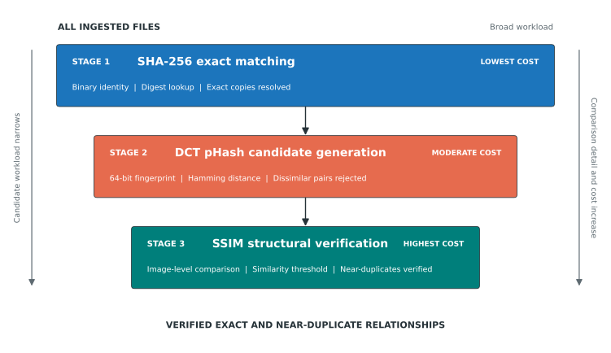

# Evaluation Results

The dissertation evaluates the image-deduplication pipeline from four
complementary perspectives: processing cost, threshold selection, robustness to
image transformations, and scalability. Together, these evaluations test both
detection quality and the computational consequences of the three-stage design.

## Evaluation structure

| Evaluation | Question | Evidence |
| --- | --- | --- |
| [1. Pipeline runtime](evaluation-1.md) | Where is processing time spent? | Per-stage runtime and candidate counts |
| [2. Threshold selection](evaluation-2.md) | How do pHash and SSIM thresholds affect detection? | Precision, recall, F1 score, and accuracy |
| [3. Robustness](evaluation-3.md) | Which transformations remain detectable? | Recall by transformation family |
| [4. Scalability](evaluation-4.md) | How does runtime change with workload size? | Runtime growth, throughput, memory, and stage composition |

## Cost-ordered pipeline

The pipeline performs inexpensive, high-confidence work first. SHA-256 resolves
binary-identical files, pHash narrows the candidate set using perceptual
similarity, and SSIM performs the most detailed comparison only on surviving
pairs. This ordering limits the number of expensive structural comparisons.

*Figure 1. The candidate workload narrows as comparison detail and cost increase.*

[PNG version](../thesis-assets/figure-1-cost-ordered-cascade.png) | [SVG version](../thesis-assets/figure-1-cost-ordered-cascade.svg)

## Reproducibility

The figures are generated by `tools/build_thesis_figures.py`. Their inputs are
the versioned evaluation summaries, prediction exports, and reference labels in
the repository. The SVG files are used in this site for resolution-independent
display; matching PNG files are retained for documents and software that do not
support SVG.